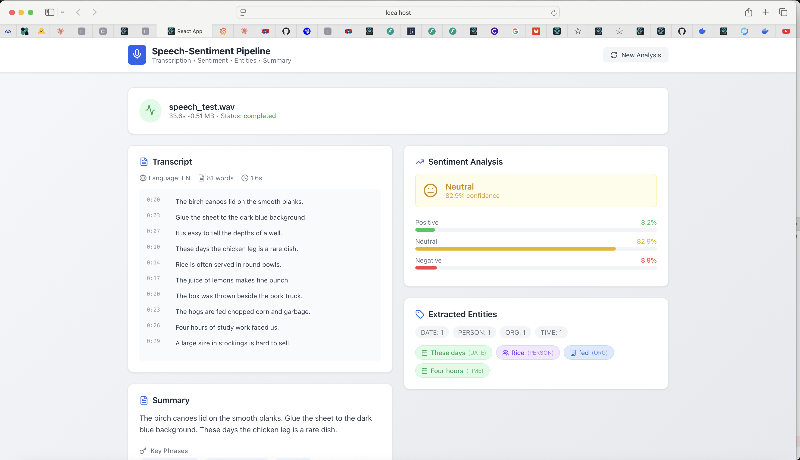

# Speech-to-Text + Sentiment Analysis Pipeline

Real-time speech transcription with sentiment analysis and entity extraction for customer service call analysis.

## Screenshots

### Upload Screen


### Analysis Results


## Features

- **Audio Upload**: Support for MP3, WAV, M4A, FLAC, OGG formats
- **Transcription**: Real-time speech-to-text using OpenAI Whisper
- **Sentiment Analysis**: Positive/negative/neutral classification using RoBERTa
- **Entity Extraction**: Named entity recognition (names, dates, organizations)
- **Summarization**: Automatic call summary with key phrases and action items
- **Word Timestamps**: Word-level timing for transcript synchronization

## Target Metrics

| Metric | Target | Description |
|--------|--------|-------------|
| WER | <10% | Word Error Rate |
| Sentiment Accuracy | 85%+ | Classification accuracy |
| Processing Time | <2x audio | 1 min audio = <2 min processing |
| Entity F1 | 0.82+ | Entity extraction quality |

## Tech Stack

| Component | Technology |
|-----------|------------|
| Speech-to-Text | OpenAI Whisper |
| Sentiment Analysis | RoBERTa (HuggingFace) |
| Entity Extraction | spaCy NER |
| Backend | FastAPI + SQLAlchemy |
| Frontend | React + TypeScript |
| Database | SQLite (dev) / PostgreSQL (prod) |

## Quick Start

### Prerequisites

- Python 3.9+
- Node.js 18+
- FFmpeg

### Backend Setup
```bash
# Clone repository
git clone https://github.com/cuthbertola/speech-sentiment-pipeline.git
cd speech-sentiment-pipeline

# Setup backend
cd backend
python -m venv venv
source venv/bin/activate  # Windows: venv\Scripts\activate
pip install -r requirements.txt

# Download NLP models
python -m spacy download en_core_web_sm

# Run server
python -m uvicorn app.main:app --reload --port 8002
```

### Frontend Setup
```bash
# In a new terminal
cd frontend
npm install
npm start
```

Open http://localhost:3000 in your browser.

## API Endpoints

| Method | Endpoint | Description |
|--------|----------|-------------|
| POST | `/api/v1/audio/upload` | Upload audio file |
| POST | `/api/v1/audio/{id}/process` | Process audio through pipeline |
| GET | `/api/v1/audio/` | List all audio files |
| GET | `/api/v1/analysis/{id}/full` | Get full analysis |
| GET | `/api/v1/analysis/{id}/transcript` | Get transcript |
| GET | `/api/v1/analysis/{id}/sentiment` | Get sentiment analysis |
| GET | `/api/v1/analysis/{id}/entities` | Get extracted entities |
| GET | `/api/v1/analysis/{id}/summary` | Get summary |
| GET | `/api/v1/health/` | Health check |

## Project Structure
```
speech-sentiment-pipeline/
├── backend/
│   ├── app/
│   │   ├── main.py              # FastAPI entry point
│   │   ├── config.py            # Configuration
│   │   ├── api/routes/          # API endpoints
│   │   ├── models/              # Database & Pydantic models
│   │   ├── services/            # ML services
│   │   │   ├── transcription.py # Whisper service
│   │   │   ├── sentiment.py     # Sentiment analysis
│   │   │   ├── entity.py        # Entity extraction
│   │   │   ├── summarization.py # Summarization
│   │   │   └── pipeline.py      # Orchestration
│   │   └── core/                # Database connection
│   └── requirements.txt
├── frontend/
│   ├── src/
│   │   ├── components/          # React components
│   │   ├── services/            # API client
│   │   ├── types/               # TypeScript types
│   │   └── App.tsx              # Main app
│   └── package.json
├── docs/images/                  # Screenshots
└── README.md
```

## API Response Example
```json
{
  "audio": {
    "id": 1,
    "filename": "speech_test.wav",
    "duration_seconds": 33.6,
    "status": "completed"
  },
  "transcript": {
    "full_text": "The birch canoes lid on the smooth planks...",
    "language": "en",
    "word_count": 81,
    "processing_time_seconds": 1.6
  },
  "sentiment": {
    "overall_sentiment": "neutral",
    "confidence": 0.829,
    "scores": {
      "positive": 0.082,
      "negative": 0.089,
      "neutral": 0.829
    }
  },
  "entities": {
    "entities": [
      {"text": "These days", "label": "DATE"},
      {"text": "Four hours", "label": "TIME"}
    ],
    "entity_counts": {"DATE": 1, "PERSON": 1, "ORG": 1, "TIME": 1}
  },
  "summary": {
    "summary": "The birch canoes lid on the smooth planks...",
    "key_phrases": ["the birch canoes", "the smooth planks", "the sheet"]
  }
}
```

## Configuration

Environment variables (`.env`):
```env
WHISPER_MODEL_SIZE=base    # tiny, base, small, medium, large
WHISPER_DEVICE=cpu         # cpu or cuda
SENTIMENT_MODEL=cardiffnlp/twitter-roberta-base-sentiment-latest
```

## Author

**Olawale Badekale**
- GitHub: [@cuthbertola](https://github.com/cuthbertola)
- LinkedIn: [Olawale Badekale](https://www.linkedin.com/in/badekaleolawale/)

## License

This project is licensed under the MIT License.
